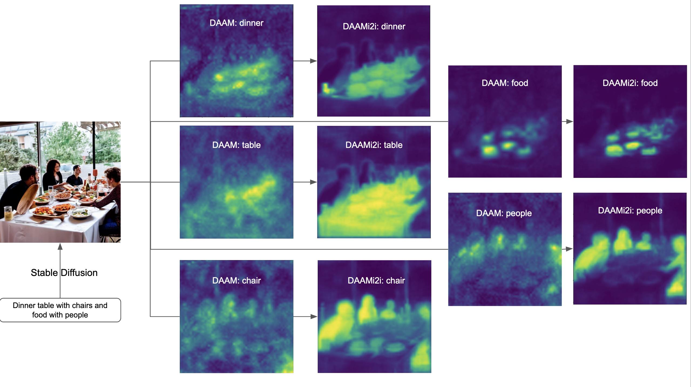

# DAAM-Image2Image: Extension of DAAM for Image Self-Attention in Diffusion Models

DAAM-Image2Image is an extension for Diffusion Attentive Attribution Map which captures image self-attention attention whereas originally DAAM captured only text-image cross-attention. A guided self-attention significantly boost the heatmap qualites. Below are some comparisons.
- The heatmap comparision of DAAM-I2I to [Original DAAM](https://github.com/castorini/daam).
  
- An immediate benefit of `DAAM-I2I` over `DAAM` is segmentation and object detection tasks for the [TITAN](https://github.com/RishiDarkDevil/TITAN) workflow (`DAAM-I2I` results on left and `DAAM` on the right)
  

In [original DAAM paper](https://arxiv.org/abs/2210.04885), the author proposes diffusion attentive attribution maps (DAAM), a cross attention-based approach for interpreting Stable Diffusion for interpretability of token heatmap over latent images. Here, I use the same approach but extended for latent image self-attention heatmaps.

**NOTE:** `daami2i` alone is just a self-attention image heatmap generator for diffusion models. But when combined with `daam` cross-attention text-image heatmap generator with optimal merging or weighing schemes and additions, it produces fantastic results as shown above.

## Getting Started
First, install [PyTorch](https://pytorch.org) for your platform. 
- You may check out the [Notebook](https://github.com/RishiDarkDevil/Text-Based-Object-Discovery/blob/main/Experiments/DAAM_Image_Attention_ver2.ipynb) to get started with the basics.
- If you interested in various merging schemes for generate interesting heatmaps like the one shown above and use them for object detection leveraging [TITAN](https://github.com/RishiDarkDevil/TITAN), check out this [Colab Tutorial](https://colab.research.google.com/drive/1OeKbTPrtsovA08a5qztilaoWlV_emMIU?usp=sharing)

### Installation
The following steps are useful for setting up `daami2i` package in Colab Environment.

```console
!pip install git+https://github.com/RishiDarkDevil/daam-i2i.git
```

### Using DAAM as a Library

Import and use DAAM as follows:

```python
# Plotting
from matplotlib import pyplot as plt

# Data Handling
import numpy as np

# Image Processing
from PIL import Image

# Image Generation
from diffusers import StableDiffusionPipeline
import daami2i

DEVICE = 'cuda' # device

model = StableDiffusionPipeline.from_pretrained('stabilityai/stable-diffusion-2-base')
model = model.to(DEVICE) # Set it to something else if needed, make sure DAAM supports that

prompt = 'Dinner table with chairs and flower pot'

# Image generation
with daami2i.trace(model) as trc:
  output_image = model(prompt).images
  global_heat_map = trc.compute_global_heat_map()
  
display(output_image[0]) # Output image
```
There are 3 types of visualizations available:
- **Pixel-based:** The pixels are numbered in row-major order i.e.
  - 0     1 .. 63\
  4032 4033 .. 4095\
  Only latent image height and width is valid (i.e. 64 x 64 for Stable Diffusion v2 base) so the pixels that can be mentioned is a list (i.e. from 0 ... 4095 for SDV2).
  ```python
  # Example
  # Compute heatmap for latent pixel lists row-major. It will return the heatmap for pixels [0,1,..,1023]
  pixel_heatmap = global_heat_map.compute_pixel_heat_map(list(range(1024))).expand_as(output_image[0]).numpy()

  # Casting heatmap from 0-1 floating range to 0-255 unsigned 8 bit integer
  heatmap = np.array(pixel_heatmap * 255, dtype = np.uint8)
  
  plt.imshow(heatmap)
  ```

- **BBox-based:** The bounding box's upper left and bottom right corner needs to be specified. Again latent height and width are valid ranges (i.e. for SDV2 the top-left corner of the bbox cannot be more lefter or higher than 0,0 and the bottom-right corner of the bbox cannot be more righter or downer than 63,63).
  ```python
  # Example
  # Compute heatmap for latent bbox pixels with corners specified
  pixel_heatmap = global_heat_map.compute_bbox_heat_map(0,10,25,64).expand_as(output_image[0]).numpy()
  
  # Casting heatmap from 0-1 floating range to 0-255 unsigned 8 bit integer
  heatmap = np.array(pixel_heatmap * 255, dtype = np.uint8)
  
  plt.imshow(heatmap)
  ```

- **Contour-based:**. The image height and width can be different from the latent height and width. Enter contour and attention map will be generated for that contour containing pixels i.e. if you have a contour for the generated image (say 512 x 512) then the contour lines will be on this bigger image and not on the latent image. While calling make sure to pass the image size as shown below. 
  ```python
  # Example
  # Compute heatmap for inner pixels for contour boundary specified
  pixel_heatmap = global_heat_map.compute_contour_heat_map([[0,300], [256, 100], [512, 300], [512, 400], [0, 400], [0, 300]], 512, 512).expand_as(output_image[0]).numpy()

  # Casting heatmap from 0-1 floating range to 0-255 unsigned 8 bit integer
  heatmap = np.array(pixel_heatmap * 255, dtype = np.uint8)

  plt.imshow(heatmap)
  ```

- **Multi-Contour based:** To handle merging pixel heatmaps for multiple contours. It is an extension for the `compute_contour_heat_map` which can handle only single contour. Function: `compute_segmentation_heat_map`

- **Guided Heatmap-based**: It merges all the pixel heatmaps based on some weighing scheme provided by another heatmap called the `guide_heatmap`. The `guide_heatmap` should be of the dimension of the latent image. Function: `compute_guided_heat_map`

## Citation

DAAM-I2I: Add Link to this project as citation in your work.

## References

- [Original DAAM](https://github.com/castorini/daam)
